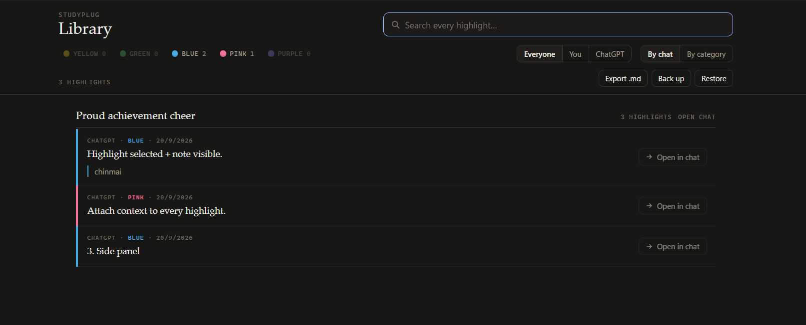
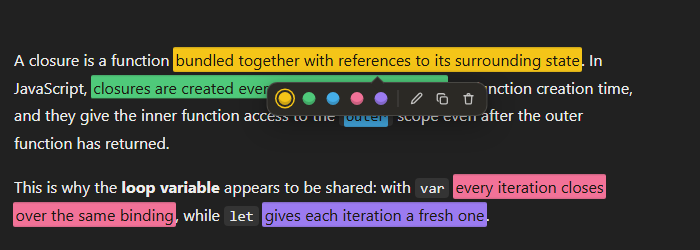
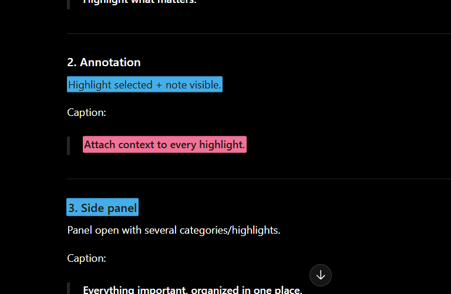
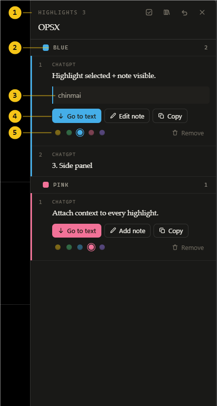

<div align="center">


# StudyPlug

**A highlighter for ChatGPT.** Mark passages, file them under your own
categories, and find them again across every conversation you have ever had.




</div>

## What it does

| | |
| --- | --- |
| **Highlight** | Five colours, on any passage in any message. Select and pick, <kbd>Alt</kbd>+<kbd>1</kbd>…<kbd>5</kbd>, or right-click. |
| **Survives** | Reloads, React re-renders, switching conversations, and turns that get edited or regenerated. |
| **Categories** | Rename the colours to what you mean. "Blue" becomes "Methodology", everywhere it appears. |
| **Notes** | Attach your own context to any passage. |
| **Side panel** | <kbd>Alt</kbd>+<kbd>H</kbd>. This chat's marks, grouped by category, in reading order, with jump-to-passage. |
| **Library** | Every chat at once. Full-text search over passages *and* notes, filters, deep links back to the exact sentence. |
| **Export** | Markdown grouped by category or chat. JSON backup and restore that is safe to run twice. |
| **Undo** | On everything destructive, including bulk actions. |

Storage is `chrome.storage.local` on your machine. No account, no server, and no
network code anywhere in the extension — three permissions plus host access to
ChatGPT is the whole list.

## Install

No build step. What is in `src/` is what runs.

```bash
git clone https://github.com/ChinmaiShetti/studyplug
```

1. Open `chrome://extensions` (or `edge://extensions`)
2. Turn on **Developer mode**
3. **Load unpacked** → choose the folder
4. Open or reload a tab on [chatgpt.com](https://chatgpt.com)

Reload the ChatGPT tab after changing anything in `src/content/` — content
scripts only attach on page load.

## Highlighting

Select text in any ChatGPT message. A tray opens under the selection — below it,
because ChatGPT puts its own "Ask ChatGPT" bubble above one.

<div align="center">

</div>

Click an existing highlight to get the same tray back with that highlight's
controls: recolour, note, copy, remove.

## Where your marks live

### 1 · In the conversation

Marks are drawn as real marker strokes — a gradient that clears the tops of the
letters and pools at the baseline, not a flat rectangle behind the text.



### 2 · The side panel — <kbd>Alt</kbd>+<kbd>H</kbd>

Everything you marked in *this* chat, grouped by category and ordered the way it
appears in the conversation, not the order you marked it.



**1** — select several, open the library, undo, close.

**2** — the category name. Click the pencil and call it whatever you
actually mean. "Blue" becomes "Methodology".

**3** — a note attached to that passage. Yours, not ChatGPT's.

**4** — **Go to text** scrolls the conversation to that exact sentence and
flashes it. Copy takes the passage and its note together.

**5** — move a highlight to a different category without re-marking it.

Non-adjacent passages stay separate, numbered entries. Two blue marks three
turns apart are items 1 and 2, in that order — never merged, never shuffled.

Hovering an entry outlines the passage back in the page, so you can connect the
list to the conversation without jumping anywhere.

<br clear="right">

### 3 · The library

The panel knows one conversation. The library knows all of them.

Search runs over passages **and** your notes, so `gate March` finds a passage
about the evaluation gate whose note mentions the March review. Matches are
marked in the results, so you can see *why* something is in the list. Filter by
category, by who said it, group by chat or by category — your Architecture notes
from every conversation in one column.

**Open in chat** opens the source conversation and scrolls to the passage.

<br>

## What you get out

Not a screenshot of your notes. An actual document. This is a real export file,
trimmed to its first two entries:

```markdown
# ChatGPT highlights

3 highlights · 20/9/2026

## Proud achievement cheer

**ChatGPT** · Blue

> Highlight selected + note visible.

*Note: chinmai*

---

**ChatGPT** · Pink

> Attach context to every highlight.
```

Group it by category instead and the headings become your own names, with each
passage citing the chat it came from. There is also a JSON backup that restores
faithfully — and **restoring the same backup twice changes nothing the second
time**, which is a property with a test guarding it.

<br>

## How a highlight survives ChatGPT

This is the part that makes the whole thing work, and the part that is not
obvious.

ChatGPT is a React app. It throws message turns away and rebuilds them —
when you scroll, when you switch conversations, when it feels like it. A
highlight stored as "the third `<span>` inside the second `<div>`" is dead on
the first re-render.

So nothing is stored against the DOM. A highlight is a **character range inside
one message turn**, plus a copy of its own text:

```
  What ChatGPT renders                     What StudyPlug stores
  ────────────────────                     ─────────────────────
  <div data-message-id="c7f3…">            msgId   c7f3…      ← server-assigned,
    <p>The <b>reranker</b> runs                                 survives reloads
       over a candidate pool.</p>          start   4
  </div>                                   end     22
                                           text    "reranker runs over"
  the turn's text, concatenated:                   └──────┬──────┘
  "The reranker runs over a candidate…"                   │
   0    5    10   15   20                        the checksum that makes
                                                 re-anchoring possible
```

Wrapping text in `<mark>` does not change `textContent`. So the offsets stay
correct no matter how many highlights are already painted — and that is what
lets this work:

```
  ① fresh page              ② React rebuilt the turn     ③ answer regenerated,
                               (offsets unchanged)           everything shifted

  text at 4..22 matches     marks were wiped              text at 4..22 is now
  the checksum              → repaint at 4                something else
  → paint it                                              → search for the
                                                            checksum, found at 42
                                                          → paint there, and
                                                            write 42 back
```

If the passage is gone entirely — the answer was regenerated into something
different — nothing is painted at all. **A missing highlight beats a misplaced
one**, and that is a deliberate choice with a test on it.

<br>

## Five things that tried to break this

Every one of these is a real bug that shipped into a working build, got found,
and now has a test standing over its grave.

### 1 · The list that grew blank lines

> **Symptom** — highlighting across bullet points opened a blank line between every item.

The cause: dragging a selection across a list also covers the newline between
`</li>` and `<li>`, which normally renders as nothing. Wrapping *that* in a
`<mark>` puts an inline box between two block boxes, so the browser builds an
anonymous line box to hold it — and there is your blank line.

Collapsible whitespace is now never painted. Inside `<pre>` it still is, because
there the same characters are real content and skipping them would leave a
highlight across a code block full of holes.

### 2 · ChatGPT stealing the keyboard mid-word

> **Symptom** — typing a category name went into ChatGPT’s “Ask anything” box instead.

ChatGPT focuses its composer whenever it sees a keystroke that is not already in a
field — and it cannot see into a shadow root. From its listener, an event raised
inside our panel **retargets to the host**, which is a plain `<div>`. It
concluded nobody was typing and took the focus.

A listener on the field itself cannot stop that; the page acts in the capture
phase, long before the event arrives. The guard sits on `window` in the capture
phase, ahead of the page's own handler, and uses `composedPath()` to see through
the boundary the page cannot. <kbd>Enter</kbd>, <kbd>Esc</kbd> and <kbd>Tab</kbd>
are let through — stopping a capture-phase event halts it *before* the target,
so swallowing those would mean the rename box never sees its own Enter.

### 3 · Dark mode drained the colour out

> **Symptom** — five distinct inks all converged on the same muddy grey-brown.

Not a palette problem — a ceiling. The composited band has to stay
dark enough for the white text on it to stay readable, which caps how much
colour any ink can carry. Measured as CIE76 ΔE, the closest pair sat at **21.5**,
under the ~25 where two colours read as "similar" at a glance.

The fix was to stop fighting it: opaque ink, dark text on top, the way a
highlighter works on paper. Same five colours now separate at **ΔE 53.2**, and
text contrast runs **5.49:1 to 10.90:1** — above WCAG AA, and *identical* in
light and dark mode.

### 4 · Its own tooltip in the way

> **Symptom** — the tray opened directly underneath ChatGPT’s own “Ask ChatGPT” bubble.

It opens below the selection now, flips up only when there is no room below,
and pins inside the viewport if neither side fits. The smallest fix of the five,
and the only one caused by somebody else’s UI rather than our own.

### 5 · Ordering that scrambled itself

> **Symptom** — in long chats the panel listed passages in an order that matched nothing.

Lists mixed two incompatible coordinate systems: a live DOM index and a stored
turn index. In a long chat ChatGPT only keeps part of the conversation loaded,
so the loaded turns are indexed `0..n` while the stored turns they came from
might be `20..30`. Ranking them on one scale scrambles the list. Loaded and
unloaded turns are now ranked separately and never compared.

<br>

## Every control

| Action | How |
| --- | --- |
| Highlight | Select text, pick a colour from the tray |
| …without the mouse | Select text, <kbd>Alt</kbd>+<kbd>1</kbd>…<kbd>5</kbd> |
| …by right-click | Select text → **Highlight with StudyPlug** → a category |
| Change colour | Click the highlight, pick another (or <kbd>Alt</kbd>+<kbd>1</kbd>…<kbd>5</kbd>) |
| Add or edit a note | Click the highlight → pencil (<kbd>Ctrl</kbd>+<kbd>Enter</kbd> saves) |
| Copy the passage | Click the highlight → copy icon |
| Remove | Click the highlight → trash icon |
| **Undo** | The toast's **Undo**, the panel's arrow, or <kbd>Ctrl</kbd>+<kbd>Z</kbd> |
| Open / close the panel | <kbd>Alt</kbd>+<kbd>H</kbd>, the edge tab, or popup → **Open in chat** |
| Rename a category | Panel group header → pencil |
| Select several | Panel header → tick icon, or `x` on a focused entry |
| Move around the panel | `j` / `k`, <kbd>Enter</kbd> to open, `g` to jump |
| Search every chat | Panel header → library icon, or popup → **Library** |
| Export / back up | In the library: **Export .md**, **Back up**, **Restore** |
| Dismiss the tray | <kbd>Esc</kbd>, or click elsewhere |

Shortcuts are ignored while you are typing, in ChatGPT's composer *and* in
StudyPlug's own fields.

**Nothing destructive is final.** Removing, clearing, recolouring, editing a
note and replacing a highlight by re-marking over it are all undoable — the last
ten of them. Each action records its own inverse rather than a snapshot, because
re-marking a passage needs two operations at once: bring back what it displaced
*and* remove what it added.

<br>

## Where things live

```
manifest.json            MV3 manifest
src/shared/              loaded by content scripts AND extension pages, so none
                         of it may assume a ChatGPT page
  palette.js             the five inks + your category names
  records.js             the storage layout and its readers
  search.js              query parsing, matching, match marking
  export.js              Markdown, backup, and the restore planner
src/content/
  core.js                namespace and shared helpers
  anchor.js              selection → stored range, painting it back, reading order
  store.js               conversation identity
  undo.js                the undo stack (DOM work injected, so it is testable)
  ui.js                  the floating tray (shadow DOM)
  panel.js               the side panel (shadow DOM)
  main.js                events, state, the panel's API, the popup channel
  content.css            how a mark looks on the page
src/popup/               toolbar popup: flat list, filters, export
src/library/             the cross-conversation library
src/background/          service worker: context menu + opening the library
```

There is no bundler, so **load order is the dependency graph** — and it is
declared in two places that have to agree: `content_scripts.js` in the manifest,
and the `<script>` tags in each page. Nothing catches a mismatch at build time;
the symptom is an undefined global thrown somewhere unrelated. `npm run
check:structure` checks that wiring, because a test suite cannot see it.

<br>

## Storage and privacy

`chrome.storage.local`, on your machine. No network code exists in this
extension — not disabled, not opt-out, *absent*.

```
cp:conv:<conversationId>  →  { convId, title, url, updated, items: [...] }
cp:index                  →  { <conversationId>: { title, url, count, updated } }
cp:labels                 →  { <colourKey>: "your name" }, only the renamed ones
cp:panelOpen              →  whether the side panel is showing
```

Permissions: `storage`, `unlimitedStorage`, `contextMenus`, and host access to
`chatgpt.com` and `chat.openai.com`. That is the entire list.

> The `cp:` prefix predates the rename to StudyPlug. It is kept deliberately:
> those keys hold real highlights, and renaming them without a migration would
> orphan every mark already made. Backups written under the old name still load.

<br>

## Tests

```bash
npm install
npm run check      # lint + structure + 83 tests
```

The suite is `node:test` and `jsdom`, no framework. It covers the things that
actually broke: painting across `<strong>`/`<code>`/list boundaries, leaving
message text byte-identical, exact DOM restoration on removal, repainting after
a simulated re-render, re-anchoring after a regenerated turn, refusing to paint
a passage that is gone, reading order when only part of a conversation is
loaded, not opening blank lines across list items while still painting
whitespace inside a code block, search term splitting and match marking, and a
backup/restore round trip that stays idempotent.

Where logic could be a pure function, it is one — which is why the undo stack
takes its DOM work as injected callbacks, and why you can test it without a
browser.

<br>

## Contributing

See **[CONTRIBUTING.md](CONTRIBUTING.md)**. Issues and pull requests welcome.

The short version: `npm run check` must pass, match the surrounding style, and
write the test so it *would have failed before your fix*. That last one matters
here — one of the fixes above had a test harness that would have reported
success even if the fix did nothing, until a control case was added to it.

<br>

## Known limits

- **Only `/c/<id>` conversations.** A brand-new chat has no id until you send
  the first message.
- **Local only.** Highlights do not follow you between devices; use **Back up**
  and **Restore** to move them.
- **A regenerated answer loses its highlights** if the wording changed enough
  that the stored text no longer appears anywhere in the turn.
- **Highlights in turns that have not lazy-loaded** sort at the end of their
  category, and **Go to text** will tell you the turn is not on screen. Scroll
  up to load it and both resolve.
- **The panel overlays the page** rather than reflowing it. On a narrow window
  it will sit over the conversation; <kbd>Alt</kbd>+<kbd>H</kbd> closes it.
- **Opening the library repeatedly opens new tabs.** Focusing an existing one
  would need the `tabs` permission, which did not seem worth asking for.
- **Firefox** needs `browser_specific_settings.gecko.id` in the manifest;
  everything else is standard MV3.

<br>

---

<div align="center">
<sub>MIT — see <a href="LICENSE">LICENSE</a>. Built for anyone who has ever scrolled back through a chat looking for one sentence.</sub>
</div>
<kbd>Alt</kbd>+<kbd>H</kbd>.
- **Firefox** needs `browser_specific_settings.gecko.id` added to the manifest;
  everything else is standard MV3.
- **Opening the library repeatedly opens new tabs** rather than focusing the one
  already open. Focusing an existing tab would need the `tabs` permission, and
  it did not seem worth asking for that.

## Licence

MIT — see [LICENSE](LICENSE).

